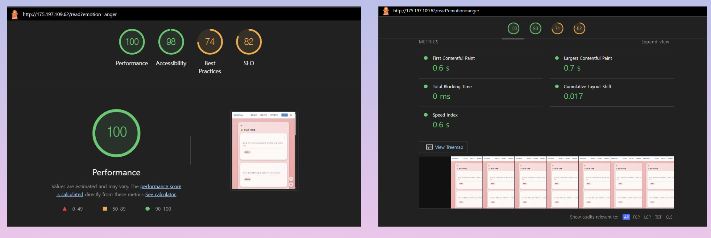
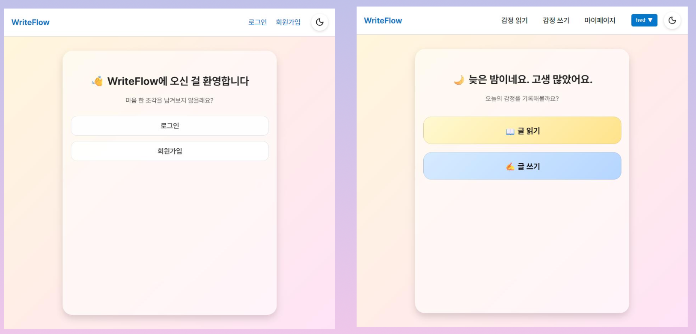

# WriteFlow

WriteFlow is an emotional micro-journaling platform built by the Code Eleven team. Users write short posts tagged with one of seven emotions, browse posts by emotion, and react through predefined buttons instead of free-form comments.

> Portfolio note: this project was originally developed as a team repository. My primary contribution was the author-side frontend experience, including authentication flows, protected routes, the post creation flow, profile page, and frontend API integration. Original team repository: <https://github.com/wjddudgns/CODE_ELEVEN>

## 中文简介

WriteFlow 是 Code Eleven 团队开发的情绪记录社区项目。用户可以围绕 7 种情绪发布短内容，通过预设互动按钮完成轻量交流，而不是传统评论区对话。

## 我的负责部分

项目中主要负责**作者端前端开发与联调**。

- 完成登录、注册、前端鉴权与受保护路由
- 完成两步式发帖流程，包括情绪选择、内容输入、按钮选择与提交
- 完成个人主页，包括最近帖子、情绪分布、互动统计
- 对接后端认证与内容 API，处理登录态、发帖、详情、删除、举报等流程
- 配合网关方案统一前端请求路径，解决本地联调中的接口访问问题

## What The Product Does

- Lets users publish short emotional posts with a 220-character limit
- Organizes posts into 7 emotion categories: Joy, Anger, Sadness, Pleasure, Love, Hate, Ambition
- Supports reaction-based interaction through 7 predefined response buttons
- Provides login, signup, token-based authentication, and protected pages
- Includes a personal profile page with post and reaction statistics
- Connects a React frontend to Spring Boot services through an Nginx gateway

## My Contribution

My main responsibility in this team project was the **author-side frontend**.

- Implemented login and signup flows with client-side validation and error handling
- Added protected routes and token-based session handling on the frontend
- Built the two-step post writing flow with emotion-first UX
- Integrated post creation, post detail, delete, and report requests with backend APIs
- Implemented profile/dashboard UI with recent posts and emotion statistics
- Helped align frontend API access through the gateway-based local environment

## Team Scope

- Reader-side frontend: public feed browsing and interaction UI
- Author-side frontend: authentication, writing flow, profile, personal post management
- Auth backend: signup, login, refresh token, JWT handling
- Content backend: post CRUD, reactions, reporting, post statistics

## Architecture

```text
Browser (Vite / React SPA)
  -> Frontend app on :5173
  -> Nginx gateway on :80
     -> /api/auth/*  -> api-auth-java :8082
     -> /api/*       -> api-core-java :8081
                       -> PostgreSQL / H2
```

## Tech Stack

- Frontend: React 18, TypeScript, Vite, React Router, Zustand, CSS
- Backend: Spring Boot 3, Spring Security, Spring Data JPA
- Auth: JWT
- Infra: Docker Compose, Nginx
- Database: PostgreSQL (prod-like), H2 (dev profile for core service)

## Project Structure

```text
.
├── apps/
│   ├── web/               # React frontend
│   ├── api-auth-java/     # Auth service
│   └── api-core-java/     # Content service
├── gateway/               # Nginx reverse proxy
├── docs/                  # Architecture and portfolio notes
├── docker-compose.dev.yml
└── WriteFlow.md           # Internal project status notes
```

## Core Frontend Pages

- `/login`: login form with API error feedback
- `/signup`: registration form with field validation
- `/read`: emotion-based post browsing
- `/write`: protected two-step writing flow
- `/post/:emotion/:id`: post detail, reaction, report, delete
- `/profile`: personal stats and recent posts

## Local Setup

### Prerequisites

- Node.js 18+
- npm
- JDK 21
- Docker + Docker Compose

### 1. Start backend services

```bash
docker compose -f docker-compose.dev.yml up --build -d
```

This starts:

- `writeflow-db`
- `api-auth-java`
- `api-core-java`
- `writeflow-gateway`

### 2. Start the frontend

```bash
cd apps/web
npm install
npm run dev
```

Frontend default URL:

- `http://localhost:5173`

Gateway default URL:

- `http://localhost`

## API Overview

### Auth service

- `POST /api/auth/signup`
- `POST /api/auth/login`
- `POST /api/auth/refresh`

### Content service

- `GET /api/posts`
- `GET /api/posts/{id}`
- `GET /api/posts/me`
- `POST /api/posts`
- `DELETE /api/posts/{id}`
- `POST /api/posts/{id}/buttons/{buttonType}`
- `POST /api/posts/{id}/report`

## Screenshots




## Attribution

This repository represents a **team project**, not a solo build.

- Team: Code Eleven
- Original upstream repository: `https://github.com/wjddudgns/CODE_ELEVEN`
- My role: author-side frontend development and integration
